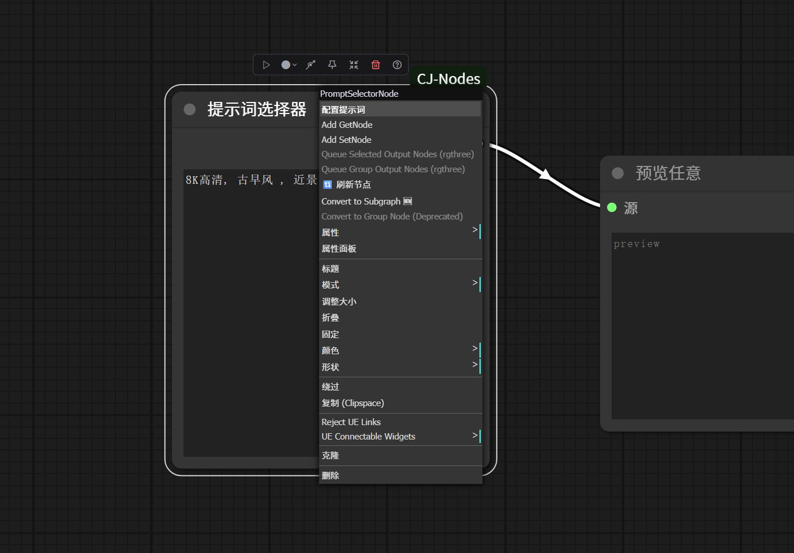
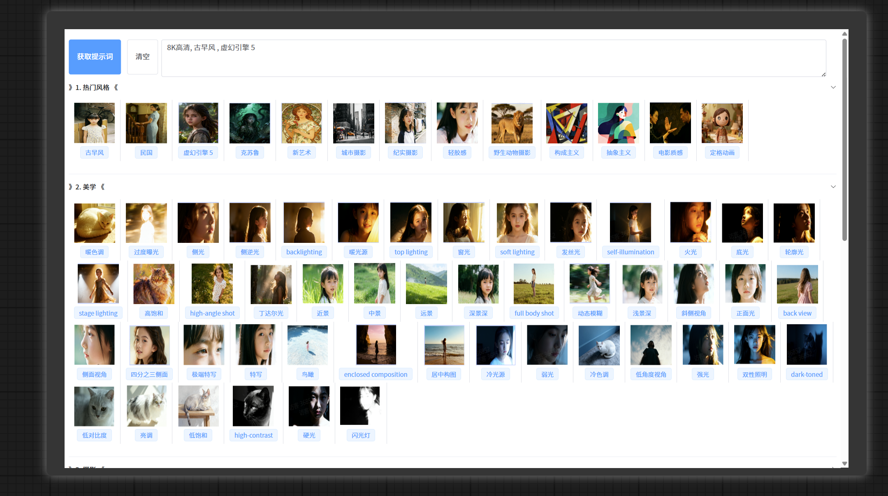
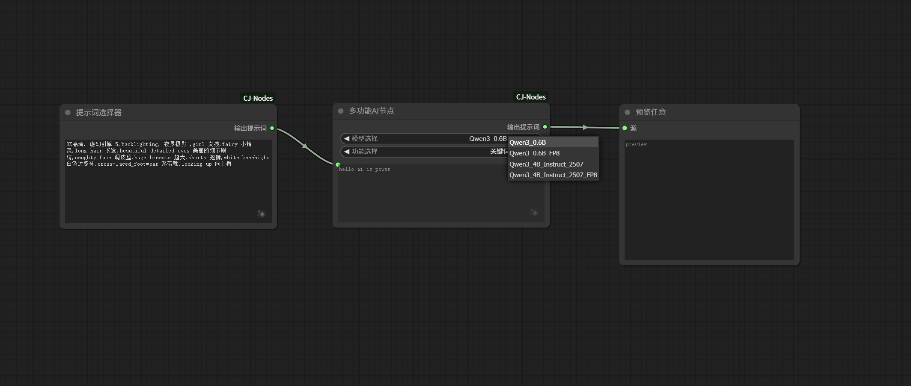
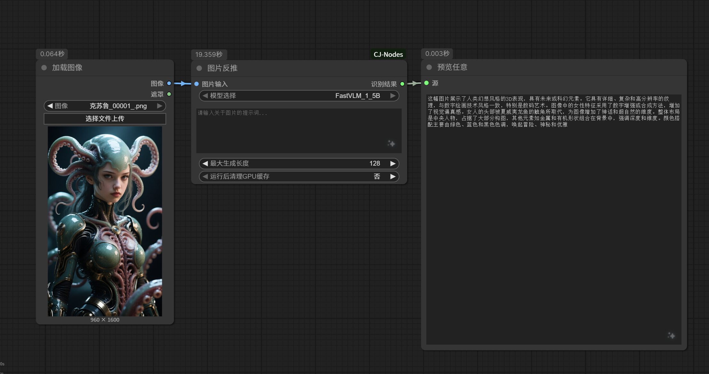
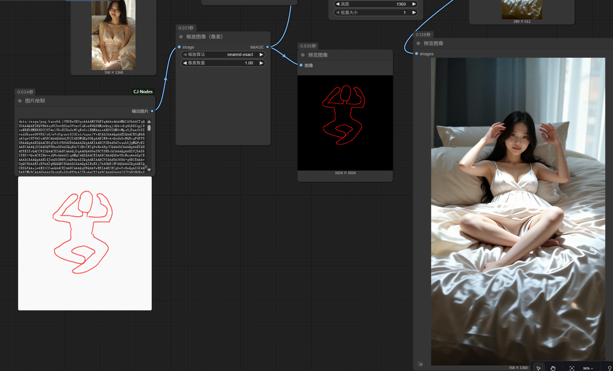
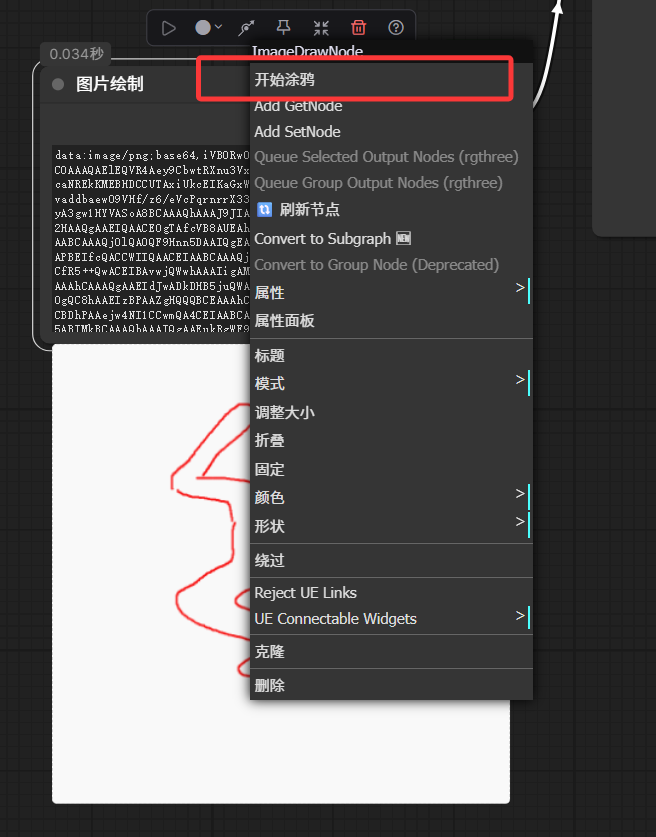
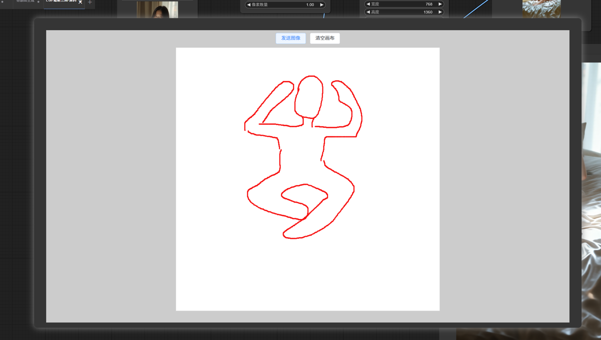
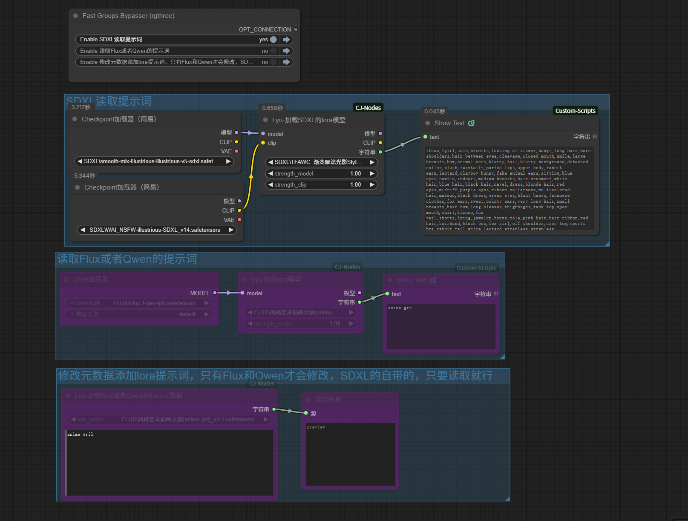

# 插件说明
> 可通过配置选择相关的场景描述，生成的描述可通过本地大模型处理，更方便，不用调用远程或者Ollama。
github：https://github.com/cjlang2020/CJ-Nodes

> 到这里下载你对应版本的llama-cpp，主要看你的python版本：https://github.com/JamePeng/llama-cpp-python/releases

## 安装
> 直接下载到 ComfyUI\custom_node目录下即可，无任何依赖，不用安装
> 模型下载地址（按需下载）：
https://hf-mirror.com/Qwen/Qwen3-0.6B
https://hf-mirror.com/Qwen/Qwen3-0.6B-FP8
https://hf-mirror.com/Qwen/Qwen3-4B-Instruct-2507
https://hf-mirror.com/Qwen/Qwen3-4B-Instruct-2507-FP8

https://hf-mirror.com/apple/FastVLM-1.5B

提示词选择

大语言模型：翻译，扩写

反推识别

涂鸦的图片直接送入编码器，不要做姿势转化（自己画的肯定转化不了，哈哈）

右键点击开始涂鸦

鼠标绘制好后，点击发送图片即可

读取和写入lora的关键触发词，避免小本子记录

